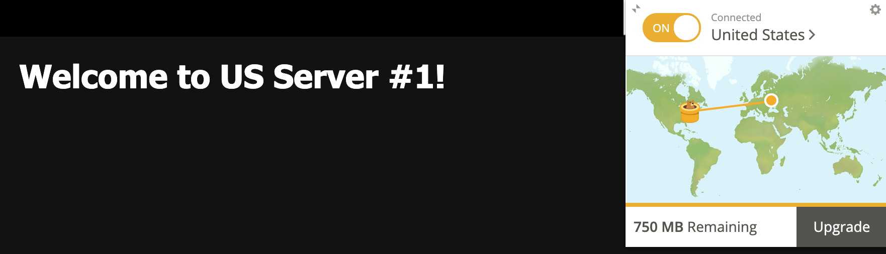
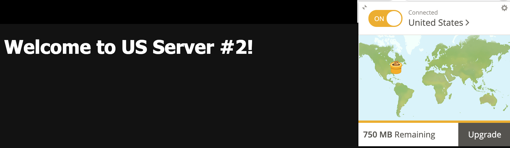
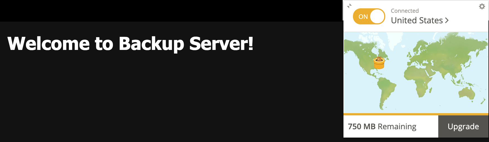
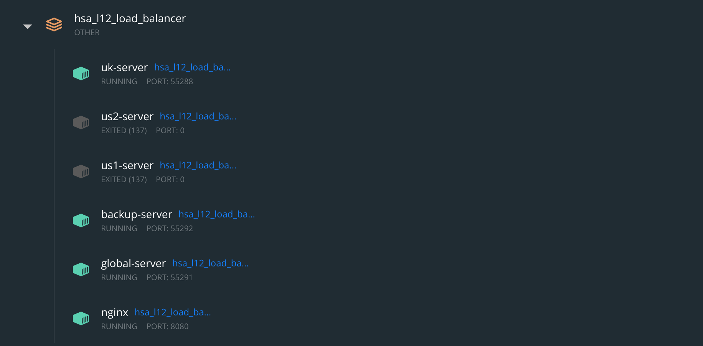
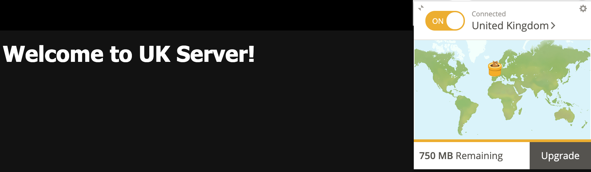

# HSA L12: Load Balancer

## Overview
This is an example project to show how to set up load balancer on nginx that will have 1 server for UK,
2 servers for US, and 1 server for the rest. In case of failure, it should send all traffic to backup server.
Health check should happen every 5 seconds.

## Getting Started

### Preparation
1. Install [Ngrok](https://ngrok.com/download) benchmarking tool. If you are using macOS, you can install it via brew
```bash
  brew install ngrok/ngrok/ngrok
```

2. Install any vpn extension to your browser. For example [TunnelBear](https://www.tunnelbear.com).

3. Run the docker containers.
```bash
  docker-compose up -d
```

Be sure to use ```docker-compose down -v``` to clean up after you're done with tests.

4. Expose local port via ngrok.
```bash
  ngrok http 8080
```

## Check balancer

1. VPN has 'United States' location enabled.



2. VPN has 'United States' location enabled. But US#1 server is down.



3. VPN has 'United States' location enabled. But all US servers are down.




4. VPN has 'United Kingdom' location enabled.



4. VPN has 'Ukraine' location enabled.

